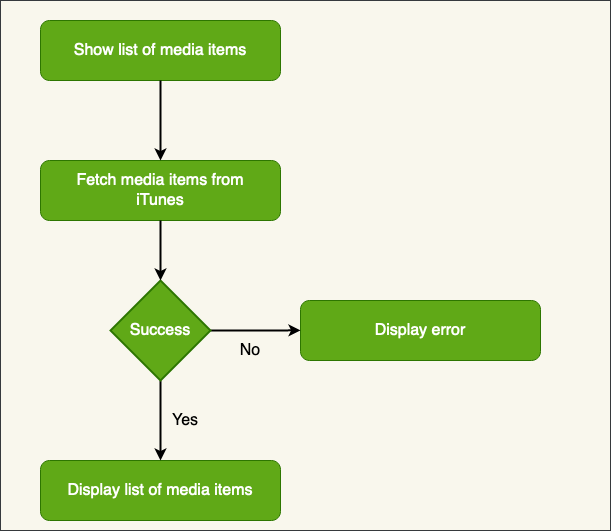
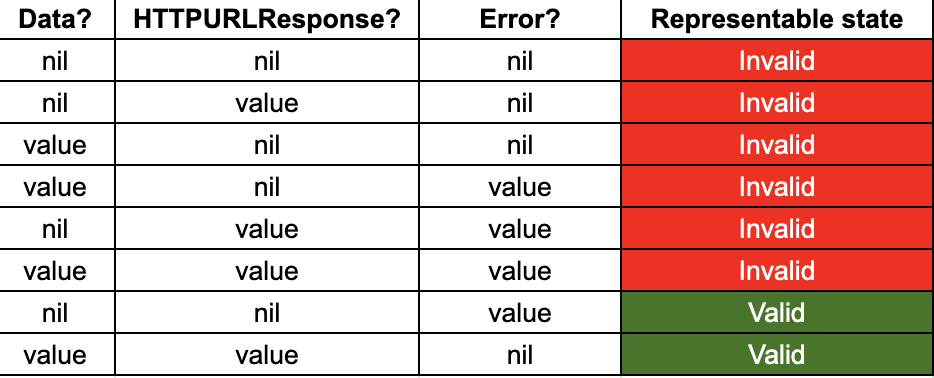

# iTunes Tracks Preview App - List of iTunes Tracks Feature

## BDD Specs 

### Story: Customer requests list of tracks by a term from iTunes

### Narrative #1

```
As an online customer
I want the app to show a list of requested by a term tracks from iTunes
So I can choose a track to preview it on a separate screen
```

#### Scenarios (Acceptance criteria)

```
Given the customer has connectivity
 When the customer requests a list of tracks by a term
 Then the app should display a list of requested tracks from iTunes 
```

### Narrative #2

```
As an offline customer
I want the app to show the error message
So I will know that I need connectivity to see requested tracks from iTunes 
```

#### Scenarios (Acceptance criteria)

```
Given the customer has no connectivity
 When th customer requests tracks
 Then the app should display an error message
```

## Use Cases

### Load Tracks by a Term Use Case

#### Data

* URL

#### Primary course (happy path):
1. Execute "Load Tracks" command with above data
2. System downloads data from the URL
3. System validates downloaded data
4. System creates a list of tracks from valid data
5. System delivers a list of tracks

#### Invalid data - error course (sad path):
1. System delivers invalid data error

#### No conectivity - error course (sad path):
1. System delivers no connectivity error

## Flowchart



## Architecture


## Model Specs

### Track Item

| Property                  | Type                |
|---------------------------|---------------------|
| `trackName`               | `String`            |
| `artistName`              | `String`            |
| `collectionName`          | `String`            |
| `artworkUrl100`	          | `URL` (optional)    |
| `artworkUrl60`	          | `URL` (optional)    |
| `previewURL`	             | `URL`               |

## Payload contract (example for `https://itunes.apple.com/search?term=jack+johnson`)
```
GET https://itunes.apple.com/search?term=*term*

200 RESPONSE

{
   "resultCount":1,
   "results":[
      {
         "wrapperType":"track",
         "kind":"song",
         "artistId":909253,
         "collectionId":1469577723,
         "trackId":1469577741,
         "artistName":"Jack Johnson",
         "collectionName":"Jack Johnson and Friends: Sing-A-Longs and Lullabies for the Film Curious George",
         "trackName":"Upside Down",
         "collectionCensoredName":"Jack Johnson and Friends: Sing-A-Longs and Lullabies for the Film Curious George",
         "trackCensoredName":"Upside Down",
         "artistViewUrl":"https://music.apple.com/us/artist/jack-johnson/909253?uo=4",
         "collectionViewUrl":"https://music.apple.com/us/album/upside-down/1469577723?i=1469577741&uo=4",
         "trackViewUrl":"https://music.apple.com/us/album/upside-down/1469577723?i=1469577741&uo=4",
         "previewUrl":"https://audio-ssl.itunes.apple.com/itunes-assets/AudioPreview125/v4/5e/5b/3d/5e5b3df4-deb5-da78-5d64-fe51d8404d5c/mzaf_13341178261601361485.plus.aac.p.m4a",
         "artworkUrl30":"https://is1-ssl.mzstatic.com/image/thumb/Music115/v4/ae/4c/d4/ae4cd42a-80a9-d950-16f5-36f01a9e1881/source/30x30bb.jpg",
         "artworkUrl60":"https://is1-ssl.mzstatic.com/image/thumb/Music115/v4/ae/4c/d4/ae4cd42a-80a9-d950-16f5-36f01a9e1881/source/60x60bb.jpg",
         "artworkUrl100":"https://is1-ssl.mzstatic.com/image/thumb/Music115/v4/ae/4c/d4/ae4cd42a-80a9-d950-16f5-36f01a9e1881/source/100x100bb.jpg",
         "collectionPrice":9.99,
         "trackPrice":1.29,
         "releaseDate":"2005-01-01T12:00:00Z",
         "collectionExplicitness":"notExplicit",
         "trackExplicitness":"notExplicit",
         "discCount":1,
         "discNumber":1,
         "trackCount":14,
         "trackNumber":1,
         "trackTimeMillis":208643,
         "country":"USA",
         "currency":"USD",
         "primaryGenreName":"Rock",
         "isStreamable":true
      }
   ]
}
```

## HTTP Client's Representable States

